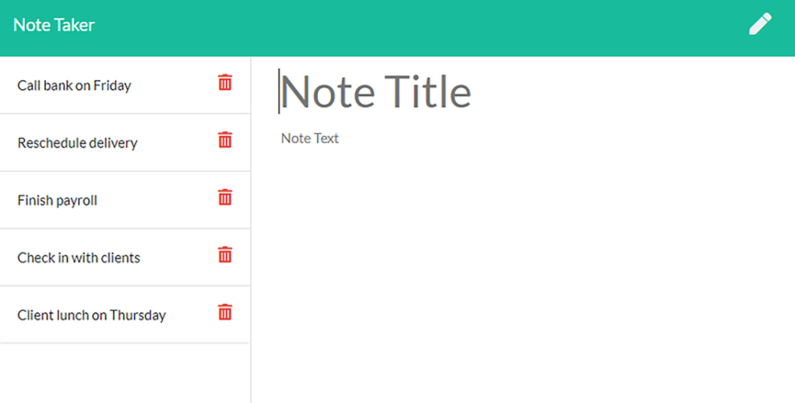

# Note-Taker

### License:
  

## Description 
An application that allows you to write, save and delete notes to organize thoughts and keep track of tasks you need to complete.

## Installation
* clone the application repo: "git@github.com:johngeorge88/Note-Taker.git"
* run (npm install)
* run (npm i express)
* run (npm i shortid)
* Run the application using the command line

## Deployed application:
You can also run the application from this link: https://evening-everglades-04658.herokuapp.com/notes

## Usage 
Run (node server) or (npm start)

## Appllication screenshot

